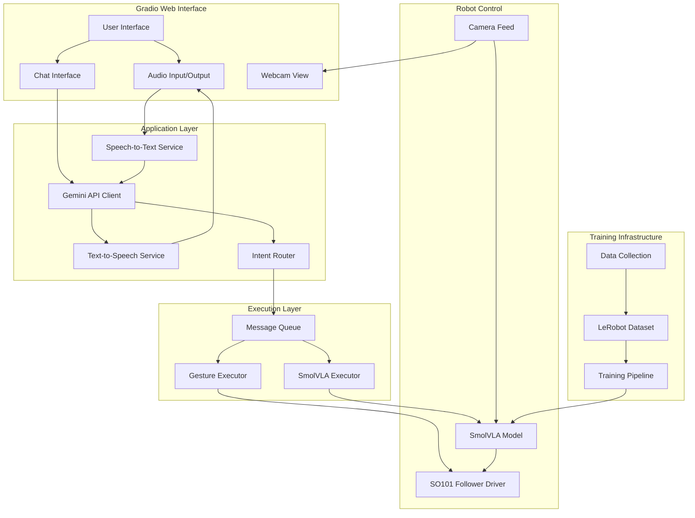

# Design Document

## Overview

This design document outlines the architecture for refactoring the Mortis interactive AI Halloween experience to support multi-modal (voice and text) interaction using Google Gemini API and SmolVLA-based robotic control. The refactor transforms Mortis from a simple gesture-based system into a sophisticated manipulation robot capable of executing precise tasks through natural language commands.

### Key Design Goals

1. Replace existing LLM API with Google Gemini API for conversational AI
2. Add voice input (STT) and voice output (TTS) capabilities
3. Integrate SmolVLA model for vision-language-action robotic control
4. Implement asynchronous execution to maintain UI responsiveness
5. Support both conversational gestures and precise manipulation tasks
6. Maintain backward compatibility with existing features
7. Enable local deployment with GPU support for SmolVLA inference

### System Context

The current Mortis system uses:
- Gradio web interface with chat and webcam view
- Generic LLM API with structured tool calling for gesture control
- LeRobot SO101Follower for predefined gesture sequences
- Synchronous execution model

The refactored system will add:
- Google Gemini API integration with intent detection
- Audio input/output components in Gradio
- SmolVLA model for learned manipulation behaviors
- Asynchronous task execution with message queuing
- Dataset collection and training infrastructure


## Architecture

### High-Level Architecture Diagram



### Architecture Layers

#### 1. Presentation Layer (Gradio Interface)
- Handles user interaction through web browser
- Provides audio input component for voice recording
- Displays chat messages and system responses
- Shows webcam feed for visual monitoring
- Plays audio responses through browser

#### 2. Application Layer (Business Logic)
- Gemini API client for conversational AI
- STT service for voice-to-text conversion
- TTS service for text-to-voice conversion
- Intent router to distinguish between conversational and manipulation commands
- Response formatter for structured outputs

#### 3. Execution Layer (Asynchronous Processing)
- Message queue for decoupling UI from long-running operations
- Gesture executor for predefined movement sequences
- SmolVLA executor for learned manipulation tasks
- Status tracking and progress reporting

#### 4. Robot Control Layer (Hardware Interface)
- SO101Follower driver for low-level servo control
- SmolVLA model for vision-language-action inference
- Camera interface for visual observations
- Safety monitoring and error recovery

#### 5. Training Infrastructure (Offline)
- Data collection tools for recording demonstrations
- LeRobot dataset management
- Training pipeline for SmolVLA model
- Model evaluation and validation

## Components and Interfaces

### 1. Gemini API Integration

#### Component: `GeminiClient`

**Purpose:** Manages all interactions with Google Gemini API for conversational AI and intent detection.

**Key Methods:**
- `send_message(user_input: str, conversation_history: list) -> GeminiResponse`
- `detect_intent(user_input: str) -> Intent`
- `configure_model(model_name: str, temperature: float)`

**Configuration:**
```python
# Environment variables
GEMINI_API_KEY=your_google_api_key
GEMINI_MODEL=gemini-2.0-flash-exp  # or gemini-1.5-pro
GEMINI_TEMPERATURE=0.2
```

**System Prompt Design:**

The Gemini system prompt must accomplish two critical functions:

1. **Character Maintenance:** Preserve Mortis personality (mischievous Halloween spirit)
2. **Intent Detection:** Identify manipulation task commands vs. conversational input

```python
GEMINI_SYSTEM_PROMPT = """
You are Mortis, a mischievous Halloween spirit inhabiting a robotic arm.

MANIPULATION TASKS:
You can perform these exact manipulation tasks:
- "Pick up the skull and place it in the green cup"
- "Pick up the skull and place it in the orange cup"
- "Pick up the skull and place it in the purple cup"
- "Pick up the eyeball and place it in the green cup"
- "Pick up the eyeball and place it in the orange cup"
- "Pick up the eyeball and place it in the purple cup"

RESPONSE FORMAT:
If user input matches a manipulation task (even with variations):
{
  "type": "manipulation",
  "command": "<exact_task_string>",
  "message": "<short in-character response, <=30 words>",
  "mood": "<ominous|playful|angry|nervous|triumphant|mischievous|sinister|curious|neutral>"
}

If user input is conversational:
{
  "type": "conversation",
  "message": "<short in-character response, <=30 words>",
  "mood": "<mood>",
  "gesture": "<idle|wave|point_left|point_right|grab|drop>"
}

Keep responses brief, in-character, no emojis or markdown.
"""
```

**Google SDK Usage:**

```python
import google.generativeai as genai

genai.configure(api_key=os.getenv("GEMINI_API_KEY"))
model = genai.GenerativeModel('gemini-2.0-flash-exp')

# For structured output, use JSON mode
generation_config = {
    "temperature": 0.2,
    "response_mime_type": "application/json"
}
```


### 2. Speech-to-Text (STT) Integration

#### Component: `STTService`

**Purpose:** Convert user voice input to text for processing by Gemini.

**Architecture Decision: Cloud vs. Local STT**

| Approach | Pros | Cons | Recommendation |
|----------|------|------|----------------|
| **Google Speech-to-Text API** | High accuracy, fast, supports streaming, integrates with Gemini ecosystem | Requires internet, API costs, data leaves local system | **Recommended for production** |
| **Local Whisper (Hugging Face)** | Privacy-preserving, no API costs, works offline | Slower inference, requires GPU/CPU resources, lower accuracy for accents | Good for offline/privacy scenarios |
| **Gemini Audio Input** | Single API integration, context-aware | Limited to Gemini models with audio support, less control | **Best option if available** |

**Recommended Implementation: Gemini Native Audio**

Gemini 2.0 models support native audio input, eliminating the need for separate STT:

```python
import google.generativeai as genai

# Upload audio file
audio_file = genai.upload_file(path="user_audio.wav")

# Send to Gemini with audio
response = model.generate_content([
    "Transcribe and respond to this audio as Mortis:",
    audio_file
])
```

**Fallback Implementation: Google Speech-to-Text**

```python
from google.cloud import speech_v1

def transcribe_audio(audio_bytes: bytes) -> str:
    client = speech_v1.SpeechClient()
    
    audio = speech_v1.RecognitionAudio(content=audio_bytes)
    config = speech_v1.RecognitionConfig(
        encoding=speech_v1.RecognitionConfig.AudioEncoding.LINEAR16,
        sample_rate_hertz=16000,
        language_code="en-US",
    )
    
    response = client.recognize(config=config, audio=audio)
    return response.results[0].alternatives[0].transcript
```

**Gradio Integration:**

```python
with gr.Blocks() as demo:
    audio_input = gr.Audio(
        sources=["microphone"],
        type="filepath",
        label="Speak to Mortis"
    )
    
    audio_input.change(
        fn=process_audio_input,
        inputs=[audio_input],
        outputs=[chatbot]
    )
```


### 3. Text-to-Speech (TTS) Integration

#### Component: `TTSService`

**Purpose:** Convert Gemini text responses to audio for voice output.

**Recommended Approach: Google Text-to-Speech API**

```python
from google.cloud import texttospeech

def synthesize_speech(text: str, output_path: str) -> str:
    client = texttospeech.TextToSpeechClient()
    
    synthesis_input = texttospeech.SynthesisInput(text=text)
    
    # Configure voice (creepy/ominous for Mortis)
    voice = texttospeech.VoiceSelectionParams(
        language_code="en-US",
        name="en-US-Neural2-D",  # Deep male voice
        ssml_gender=texttospeech.SsmlVoiceGender.MALE
    )
    
    audio_config = texttospeech.AudioConfig(
        audio_encoding=texttospeech.AudioEncoding.MP3,
        speaking_rate=0.9,  # Slightly slower for ominous effect
        pitch=-2.0  # Lower pitch for spooky voice
    )
    
    response = client.synthesize_speech(
        input=synthesis_input,
        voice=voice,
        audio_config=audio_config
    )
    
    with open(output_path, "wb") as out:
        out.write(response.audio_content)
    
    return output_path
```

**Alternative: Local TTS (pyttsx3 or gTTS)**

For offline scenarios:

```python
from gtts import gTTS

def synthesize_speech_local(text: str, output_path: str) -> str:
    tts = gTTS(text=text, lang='en', slow=True)
    tts.save(output_path)
    return output_path
```

**Gradio Integration:**

```python
def mortis_reply_with_voice(message, history, model_name):
    # Get text response from Gemini
    response_text, mood, action = process_with_gemini(message, model_name)
    
    # Generate audio
    audio_path = synthesize_speech(response_text, f"outputs/response_{time.time()}.mp3")
    
    return response_text, audio_path

with gr.Blocks() as demo:
    audio_output = gr.Audio(
        label="Mortis speaks",
        autoplay=True,
        type="filepath"
    )
```


### 4. Intent Router

#### Component: `IntentRouter`

**Purpose:** Parse Gemini responses and route to appropriate execution path.

**Design:**

```python
from enum import Enum
from dataclasses import dataclass

class IntentType(Enum):
    CONVERSATION = "conversation"
    MANIPULATION = "manipulation"

@dataclass
class Intent:
    type: IntentType
    message: str
    mood: str
    gesture: str = None
    command: str = None

class IntentRouter:
    def __init__(self):
        self.valid_commands = [
            "Pick up the skull and place it in the green cup",
            "Pick up the skull and place it in the orange cup",
            "Pick up the skull and place it in the purple cup",
            "Pick up the eyeball and place it in the green cup",
            "Pick up the eyeball and place it in the orange cup",
            "Pick up the eyeball and place it in the purple cup",
        ]
    
    def parse_gemini_response(self, response_json: dict) -> Intent:
        """Parse structured JSON response from Gemini."""
        intent_type = IntentType(response_json.get("type", "conversation"))
        
        if intent_type == IntentType.MANIPULATION:
            return Intent(
                type=IntentType.MANIPULATION,
                message=response_json["message"],
                mood=response_json["mood"],
                command=response_json["command"]
            )
        else:
            return Intent(
                type=IntentType.CONVERSATION,
                message=response_json["message"],
                mood=response_json["mood"],
                gesture=response_json.get("gesture", "idle")
            )
    
    def validate_command(self, command: str) -> bool:
        """Verify command is in trained task set."""
        return command in self.valid_commands
```

**Execution Flow:**

```python
def process_user_input(user_input: str, model_name: str):
    # 1. Send to Gemini
    gemini_response = gemini_client.send_message(user_input)
    
    # 2. Parse intent
    intent = intent_router.parse_gemini_response(gemini_response)
    
    # 3. Route to appropriate executor
    if intent.type == IntentType.MANIPULATION:
        if intent_router.validate_command(intent.command):
            # Queue for async SmolVLA execution
            task_queue.put({
                "type": "manipulation",
                "command": intent.command,
                "message": intent.message
            })
        else:
            # Invalid command, treat as conversation
            execute_gesture(intent.gesture or "idle")
    else:
        # Execute gesture immediately
        execute_gesture(intent.gesture)
    
    # 4. Generate voice response
    audio_path = tts_service.synthesize(intent.message)
    
    return intent.message, audio_path
```


### 5. Asynchronous Execution System

#### Component: `AsyncExecutor`

**Purpose:** Decouple long-running SmolVLA inference from Gradio UI to maintain responsiveness.

**Architecture Decision: Message Queue vs. Background Processing**

| Approach | Pros | Cons | Recommendation |
|----------|------|------|----------------|
| **Redis Queue** | Robust, scalable, persistent, supports distributed workers | External dependency, overkill for single-machine | Good for production/multi-worker |
| **Python asyncio.Queue** | Built-in, simple, no dependencies | Single process only, not persistent | **Recommended for this use case** |
| **multiprocessing.Queue** | True parallelism, GPU isolation | Complex IPC, harder debugging | Good if GPU contention is an issue |
| **Threading + Queue** | Simple, shared memory | GIL limitations, not ideal for CPU-bound | Not recommended for ML inference |

**Recommended Implementation: asyncio with Background Tasks**

```python
import asyncio
from queue import Queue
from threading import Thread
import gradio as gr

class AsyncExecutor:
    def __init__(self):
        self.task_queue = Queue()
        self.status_queue = Queue()
        self.worker_thread = None
        self.running = False
    
    def start(self):
        """Start background worker thread."""
        self.running = True
        self.worker_thread = Thread(target=self._worker_loop, daemon=True)
        self.worker_thread.start()
    
    def stop(self):
        """Stop background worker."""
        self.running = False
        if self.worker_thread:
            self.worker_thread.join(timeout=5)
    
    def _worker_loop(self):
        """Background thread that processes tasks."""
        while self.running:
            try:
                task = self.task_queue.get(timeout=1)
                self._execute_task(task)
            except:
                continue
    
    def _execute_task(self, task):
        """Execute a single task."""
        try:
            if task["type"] == "manipulation":
                self.status_queue.put({"status": "running", "task": task["command"]})
                
                # Execute SmolVLA inference (blocking)
                smolvla_executor.execute(task["command"])
                
                self.status_queue.put({"status": "complete", "task": task["command"]})
            elif task["type"] == "gesture":
                mortis_arm.move_arm(task["gesture"])
                self.status_queue.put({"status": "complete", "task": task["gesture"]})
        except Exception as e:
            self.status_queue.put({"status": "error", "error": str(e)})
    
    def submit_task(self, task: dict):
        """Submit task for async execution."""
        self.task_queue.put(task)
    
    def get_status(self) -> dict:
        """Get latest status update (non-blocking)."""
        try:
            return self.status_queue.get_nowait()
        except:
            return None

# Global executor instance
async_executor = AsyncExecutor()
```

**Gradio Integration with Status Updates:**

```python
def mortis_reply(message, history, model_name):
    # Process with Gemini
    intent = process_with_gemini(message, model_name)
    
    # Submit task asynchronously
    if intent.type == IntentType.MANIPULATION:
        async_executor.submit_task({
            "type": "manipulation",
            "command": intent.command
        })
        status_msg = f"🤖 Executing: {intent.command}..."
    else:
        async_executor.submit_task({
            "type": "gesture",
            "gesture": intent.gesture
        })
        status_msg = f"👻 {intent.gesture}"
    
    # Generate audio response
    audio_path = tts_service.synthesize(intent.message)
    
    return intent.message, audio_path, status_msg

def check_status():
    """Periodic status checker for Gradio."""
    status = async_executor.get_status()
    if status:
        if status["status"] == "complete":
            return f"✅ Completed: {status['task']}"
        elif status["status"] == "running":
            return f"⏳ Running: {status['task']}"
        elif status["status"] == "error":
            return f"❌ Error: {status['error']}"
    return "Idle"

with gr.Blocks() as demo:
    status_display = gr.Textbox(label="Robot Status", value="Idle")
    
    # Update status every 500ms
    demo.load(
        fn=check_status,
        outputs=[status_display],
        every=0.5
    )
```


### 6. SmolVLA Model Integration

#### Component: `SmolVLAExecutor`

**Purpose:** Execute vision-language-action inference for manipulation tasks.

**LeRobot SmolVLA Overview:**

SmolVLA is a vision-language-action model that:
- Takes visual observations (camera images) as input
- Accepts natural language task descriptions
- Outputs robot actions (joint positions/velocities)
- Trained end-to-end on demonstration data

**Model Architecture:**

```python
from lerobot.common.policies.smolvla.modeling_smolvla import SmolVLAPolicy
from lerobot.common.policies.smolvla.configuration_smolvla import SmolVLAConfig
import torch
from PIL import Image

class SmolVLAExecutor:
    def __init__(self, checkpoint_path: str, device: str = "cuda"):
        self.device = device
        self.policy = self._load_model(checkpoint_path)
        self.camera = self._init_camera()
    
    def _load_model(self, checkpoint_path: str) -> SmolVLAPolicy:
        """Load trained SmolVLA model from checkpoint."""
        config = SmolVLAConfig.from_pretrained(checkpoint_path)
        policy = SmolVLAPolicy.from_pretrained(
            checkpoint_path,
            config=config
        )
        policy.to(self.device)
        policy.eval()
        return policy
    
    def _init_camera(self):
        """Initialize camera for visual observations."""
        from lerobot.common.robot_devices.cameras.opencv import OpenCVCamera
        camera = OpenCVCamera(camera_index=0, fps=30, width=640, height=480)
        camera.connect()
        return camera
    
    def execute(self, command: str, max_steps: int = 500):
        """
        Execute manipulation task using SmolVLA.
        
        Args:
            command: Natural language task description
            max_steps: Maximum inference steps
        """
        print(f"SmolVLA executing: {command}")
        
        with torch.no_grad():
            for step in range(max_steps):
                # Capture current observation
                observation = self._get_observation()
                
                # Add task instruction
                observation["task"] = command
                
                # Run inference
                action = self.policy.select_action(observation)
                
                # Send action to robot
                self._send_action(action)
                
                # Check if task complete (implementation-specific)
                if self._is_task_complete(observation, step):
                    break
        
        print(f"SmolVLA completed: {command}")
    
    def _get_observation(self) -> dict:
        """Get current robot observation."""
        # Capture image
        image = self.camera.read()
        
        # Get robot state
        robot_state = mortis_arm.robot.get_state()
        
        return {
            "observation.image": torch.from_numpy(image).to(self.device),
            "observation.state": torch.tensor(robot_state).to(self.device)
        }
    
    def _send_action(self, action: torch.Tensor):
        """Send predicted action to robot."""
        action_dict = self._action_to_dict(action)
        mortis_arm.robot.send_action(action_dict)
    
    def _action_to_dict(self, action: torch.Tensor) -> dict:
        """Convert action tensor to SO101 command format."""
        # Map action dimensions to joint names
        joint_names = [
            "shoulder_pan.pos",
            "shoulder_lift.pos",
            "elbow_flex.pos",
            "wrist_flex.pos",
            "wrist_roll.pos",
            "gripper.pos"
        ]
        
        return {
            name: float(action[i].cpu().numpy())
            for i, name in enumerate(joint_names)
        }
    
    def _is_task_complete(self, observation: dict, step: int) -> bool:
        """Determine if task is complete (heuristic or learned)."""
        # Simple heuristic: fixed number of steps
        # In practice, could use learned termination classifier
        return step >= 400

# Global SmolVLA executor
smolvla_executor = None

def init_smolvla(checkpoint_path: str):
    global smolvla_executor
    smolvla_executor = SmolVLAExecutor(checkpoint_path)
```


### 7. Dataset Collection Infrastructure

#### Component: `DataCollector`

**Purpose:** Record human demonstrations for training SmolVLA model.

**LeRobot Dataset Format:**

LeRobot uses a standardized dataset format with:
- Episodes: Individual task demonstrations
- Observations: Camera images, robot states
- Actions: Robot joint commands
- Metadata: Task descriptions, timestamps

**Data Collection Script:**

```python
from lerobot.common.datasets.lerobot_dataset import LeRobotDataset
from lerobot.common.datasets.push_dataset_to_hub.utils import save_images_concurrently
from pathlib import Path
import numpy as np

class DataCollector:
    def __init__(self, dataset_name: str, repo_id: str):
        self.dataset_name = dataset_name
        self.repo_id = repo_id
        self.dataset_dir = Path(f"data/{dataset_name}")
        self.dataset_dir.mkdir(parents=True, exist_ok=True)
        
        self.dataset = LeRobotDataset.create(
            repo_id=repo_id,
            fps=30,
            robot_type="so101",
            keys=["observation.image", "observation.state", "action"]
        )
    
    def record_episode(self, task_description: str, duration: float = 30.0):
        """
        Record a single demonstration episode.
        
        Args:
            task_description: Natural language task description
            duration: Maximum recording duration in seconds
        """
        print(f"Recording episode: {task_description}")
        print("Press ENTER to start recording...")
        input()
        
        episode_data = {
            "observation.image": [],
            "observation.state": [],
            "action": [],
            "timestamp": [],
            "task": task_description
        }
        
        start_time = time.time()
        frame_count = 0
        
        print("Recording... Press CTRL+C to stop")
        
        try:
            while time.time() - start_time < duration:
                # Capture observation
                image = camera.read()
                state = mortis_arm.robot.get_state()
                
                # Record current state as "action" (for behavior cloning)
                action = state.copy()
                
                # Store data
                episode_data["observation.image"].append(image)
                episode_data["observation.state"].append(state)
                episode_data["action"].append(action)
                episode_data["timestamp"].append(time.time() - start_time)
                
                frame_count += 1
                time.sleep(1/30)  # 30 FPS
                
        except KeyboardInterrupt:
            print(f"\nRecording stopped. Captured {frame_count} frames")
        
        # Save episode to dataset
        self._save_episode(episode_data)
        
        print(f"Episode saved: {task_description}")
    
    def _save_episode(self, episode_data: dict):
        """Save episode to LeRobot dataset."""
        episode_index = len(self.dataset)
        
        # Convert to numpy arrays
        images = np.array(episode_data["observation.image"])
        states = np.array(episode_data["observation.state"])
        actions = np.array(episode_data["action"])
        
        # Add to dataset
        self.dataset.add_episode({
            "observation.image": images,
            "observation.state": states,
            "action": actions,
            "episode_index": episode_index,
            "task": episode_data["task"]
        })
        
        # Save to disk
        self.dataset.save_to_disk(self.dataset_dir)
    
    def push_to_hub(self):
        """Upload dataset to Hugging Face Hub."""
        self.dataset.push_to_hub(self.repo_id)
        print(f"Dataset pushed to: https://huggingface.co/datasets/{self.repo_id}")

# Usage script
def collect_demonstrations():
    collector = DataCollector(
        dataset_name="mortis_manipulation",
        repo_id="your-username/mortis-manipulation"
    )
    
    tasks = [
        "Pick up the skull and place it in the green cup",
        "Pick up the skull and place it in the orange cup",
        "Pick up the skull and place it in the purple cup",
        "Pick up the eyeball and place it in the green cup",
        "Pick up the eyeball and place it in the orange cup",
        "Pick up the eyeball and place it in the purple cup",
    ]
    
    for task in tasks:
        print(f"\n{'='*60}")
        print(f"Task: {task}")
        print(f"{'='*60}")
        
        # Record multiple demonstrations per task
        for demo_num in range(5):
            print(f"\nDemonstration {demo_num + 1}/5")
            collector.record_episode(task)
    
    # Upload to Hugging Face
    collector.push_to_hub()
```


### 8. Training Pipeline

#### Component: `TrainingPipeline`

**Purpose:** Train SmolVLA model on collected demonstration data.

**LeRobot Training Configuration:**

```yaml
# config/train_smolvla.yaml
defaults:
  - _self_
  - policy: smolvla

seed: 1000
dataset_repo_id: your-username/mortis-manipulation
video_backend: pyav

training:
  offline_steps: 100000
  online_steps: 0
  eval_freq: 10000
  save_freq: 10000
  log_freq: 100
  save_checkpoint: true

  batch_size: 8
  lr: 1e-4
  lr_scheduler: cosine
  lr_warmup_steps: 1000
  adam_betas: [0.9, 0.999]
  adam_weight_decay: 1e-6
  grad_clip_norm: 10.0

  delta_timestamps:
    action: "[i / ${fps} for i in range(${policy.chunk_size})]"

eval:
  n_episodes: 10
  batch_size: 10

policy:
  name: smolvla
  
  # Input dimensions
  input_shapes:
    observation.image: [3, 224, 224]
    observation.state: [6]  # 6 joints
  
  output_shapes:
    action: [6]  # 6 joint commands
  
  # Model architecture
  vision_backbone: "google/siglip-so400m-patch14-384"
  pretrained_backbone_weights: "google/siglip-so400m-patch14-384"
  
  # Action prediction
  chunk_size: 50  # Predict 50 steps ahead
  n_action_steps: 50
  
  # Training
  use_language_conditioning: true
  dropout: 0.1

device: cuda
use_amp: true  # Automatic mixed precision
```

**Training Script:**

```python
from lerobot.scripts.train import train
from lerobot.common.datasets.lerobot_dataset import LeRobotDataset
from pathlib import Path
import hydra
from omegaconf import DictConfig

@hydra.main(config_path="config", config_name="train_smolvla", version_base="1.2")
def train_smolvla(cfg: DictConfig):
    """
    Train SmolVLA model using LeRobot training pipeline.
    
    Usage:
        python -m mortis.train
    """
    # Load dataset
    dataset = LeRobotDataset(
        repo_id=cfg.dataset_repo_id,
        split="train"
    )
    
    print(f"Dataset loaded: {len(dataset)} episodes")
    print(f"Training for {cfg.training.offline_steps} steps")
    
    # Run training
    train(cfg)
    
    print("Training complete!")
    print(f"Checkpoints saved to: outputs/train/{cfg.run_name}")

if __name__ == "__main__":
    train_smolvla()
```

**Simplified Training Command:**

```bash
# Using lerobot CLI
python -m lerobot.scripts.train \
    policy=smolvla \
    env=so101 \
    dataset_repo_id=your-username/mortis-manipulation \
    training.offline_steps=100000 \
    training.batch_size=8 \
    training.save_freq=10000 \
    device=cuda \
    wandb.enable=true \
    wandb.project=mortis-smolvla
```

**Training Monitoring:**

```python
# Integration with Weights & Biases for tracking
import wandb

wandb.init(
    project="mortis-smolvla",
    config={
        "dataset": "mortis-manipulation",
        "policy": "smolvla",
        "batch_size": 8,
        "learning_rate": 1e-4
    }
)

# Logged automatically by LeRobot:
# - Training loss
# - Validation loss
# - Action prediction accuracy
# - Episode success rate
# - Sample predictions (videos)
```


## Data Models

### 1. Gemini Response Model

```python
from dataclasses import dataclass
from enum import Enum
from typing import Optional

class ResponseType(Enum):
    CONVERSATION = "conversation"
    MANIPULATION = "manipulation"

class Mood(Enum):
    OMINOUS = "ominous"
    PLAYFUL = "playful"
    ANGRY = "angry"
    NERVOUS = "nervous"
    TRIUMPHANT = "triumphant"
    MISCHIEVOUS = "mischievous"
    SINISTER = "sinister"
    CURIOUS = "curious"
    NEUTRAL = "neutral"

class Gesture(Enum):
    IDLE = "idle"
    WAVE = "wave"
    POINT_LEFT = "point_left"
    POINT_RIGHT = "point_right"
    GRAB = "grab"
    DROP = "drop"

@dataclass
class GeminiResponse:
    """Structured response from Gemini API."""
    type: ResponseType
    message: str
    mood: Mood
    gesture: Optional[Gesture] = None
    command: Optional[str] = None
    
    @classmethod
    def from_json(cls, data: dict) -> 'GeminiResponse':
        """Parse JSON response from Gemini."""
        response_type = ResponseType(data["type"])
        
        if response_type == ResponseType.MANIPULATION:
            return cls(
                type=response_type,
                message=data["message"],
                mood=Mood(data["mood"]),
                command=data["command"]
            )
        else:
            return cls(
                type=response_type,
                message=data["message"],
                mood=Mood(data["mood"]),
                gesture=Gesture(data.get("gesture", "idle"))
            )
```

### 2. Task Execution Model

```python
from dataclasses import dataclass
from enum import Enum
from typing import Optional
import time

class TaskStatus(Enum):
    QUEUED = "queued"
    RUNNING = "running"
    COMPLETE = "complete"
    FAILED = "failed"

class TaskType(Enum):
    GESTURE = "gesture"
    MANIPULATION = "manipulation"

@dataclass
class Task:
    """Represents a robot task for execution."""
    id: str
    type: TaskType
    status: TaskStatus
    created_at: float
    started_at: Optional[float] = None
    completed_at: Optional[float] = None
    error: Optional[str] = None
    
    # Task-specific data
    gesture: Optional[str] = None
    command: Optional[str] = None
    
    @classmethod
    def create_gesture_task(cls, gesture: str) -> 'Task':
        """Create a gesture execution task."""
        return cls(
            id=f"gesture_{time.time()}",
            type=TaskType.GESTURE,
            status=TaskStatus.QUEUED,
            created_at=time.time(),
            gesture=gesture
        )
    
    @classmethod
    def create_manipulation_task(cls, command: str) -> 'Task':
        """Create a manipulation execution task."""
        return cls(
            id=f"manipulation_{time.time()}",
            type=TaskType.MANIPULATION,
            status=TaskStatus.QUEUED,
            created_at=time.time(),
            command=command
        )
    
    def start(self):
        """Mark task as started."""
        self.status = TaskStatus.RUNNING
        self.started_at = time.time()
    
    def complete(self):
        """Mark task as completed."""
        self.status = TaskStatus.COMPLETE
        self.completed_at = time.time()
    
    def fail(self, error: str):
        """Mark task as failed."""
        self.status = TaskStatus.FAILED
        self.completed_at = time.time()
        self.error = error
    
    @property
    def duration(self) -> Optional[float]:
        """Get task execution duration."""
        if self.started_at and self.completed_at:
            return self.completed_at - self.started_at
        return None
```

### 3. Dataset Episode Model

```python
from dataclasses import dataclass
import numpy as np
from typing import List

@dataclass
class Episode:
    """Represents a single demonstration episode."""
    episode_index: int
    task_description: str
    images: np.ndarray  # Shape: (T, H, W, 3)
    states: np.ndarray  # Shape: (T, 6)
    actions: np.ndarray  # Shape: (T, 6)
    timestamps: np.ndarray  # Shape: (T,)
    
    @property
    def length(self) -> int:
        """Number of timesteps in episode."""
        return len(self.timestamps)
    
    @property
    def duration(self) -> float:
        """Episode duration in seconds."""
        return self.timestamps[-1] - self.timestamps[0]
    
    def validate(self) -> bool:
        """Validate episode data consistency."""
        lengths = [
            len(self.images),
            len(self.states),
            len(self.actions),
            len(self.timestamps)
        ]
        return len(set(lengths)) == 1  # All same length
```


## Error Handling

### Error Categories and Recovery Strategies

#### 1. Gemini API Errors

**Error Types:**
- Authentication failures (invalid API key)
- Rate limiting (quota exceeded)
- Network timeouts
- Invalid responses (malformed JSON)

**Recovery Strategy:**

```python
import time
from typing import Optional

class GeminiAPIError(Exception):
    """Base exception for Gemini API errors."""
    pass

class GeminiClient:
    def __init__(self, api_key: str, max_retries: int = 3):
        self.api_key = api_key
        self.max_retries = max_retries
    
    def send_message_with_retry(
        self,
        message: str,
        retry_count: int = 0
    ) -> Optional[GeminiResponse]:
        """Send message with exponential backoff retry."""
        try:
            response = self._send_message(message)
            return response
            
        except genai.types.BlockedPromptException as e:
            # Content safety filter triggered
            print(f"Prompt blocked by safety filter: {e}")
            return self._get_fallback_response()
            
        except genai.types.RateLimitError as e:
            if retry_count < self.max_retries:
                wait_time = 2 ** retry_count  # Exponential backoff
                print(f"Rate limited. Retrying in {wait_time}s...")
                time.sleep(wait_time)
                return self.send_message_with_retry(message, retry_count + 1)
            else:
                raise GeminiAPIError("Max retries exceeded for rate limit")
                
        except Exception as e:
            print(f"Gemini API error: {e}")
            return self._get_fallback_response()
    
    def _get_fallback_response(self) -> GeminiResponse:
        """Return safe fallback response on API failure."""
        return GeminiResponse(
            type=ResponseType.CONVERSATION,
            message="The spirits are restless... try again.",
            mood=Mood.OMINOUS,
            gesture=Gesture.IDLE
        )
```

#### 2. STT/TTS Errors

**Error Types:**
- Audio format incompatibility
- Service unavailable
- Transcription failures (unclear audio)

**Recovery Strategy:**

```python
class AudioProcessingError(Exception):
    """Base exception for audio processing errors."""
    pass

def process_audio_with_fallback(audio_path: str) -> str:
    """Process audio with fallback to text input."""
    try:
        # Try Gemini native audio
        transcript = transcribe_with_gemini(audio_path)
        return transcript
        
    except Exception as e:
        print(f"Gemini audio processing failed: {e}")
        
        try:
            # Fallback to Google STT
            transcript = transcribe_with_google_stt(audio_path)
            return transcript
            
        except Exception as e:
            print(f"Google STT failed: {e}")
            raise AudioProcessingError(
                "Could not process audio. Please use text input."
            )

def synthesize_speech_with_fallback(text: str) -> Optional[str]:
    """Synthesize speech with fallback to text-only."""
    try:
        audio_path = synthesize_with_google_tts(text)
        return audio_path
        
    except Exception as e:
        print(f"TTS failed: {e}. Returning text only.")
        return None  # UI will display text without audio
```

#### 3. SmolVLA Inference Errors

**Error Types:**
- Model loading failures
- GPU out of memory
- Invalid observations
- Action execution failures

**Recovery Strategy:**

```python
class SmolVLAError(Exception):
    """Base exception for SmolVLA errors."""
    pass

class SmolVLAExecutor:
    def execute_with_safety(self, command: str) -> bool:
        """Execute command with safety checks and recovery."""
        try:
            # Pre-execution validation
            if not self._validate_command(command):
                raise SmolVLAError(f"Invalid command: {command}")
            
            if not self._check_workspace_clear():
                raise SmolVLAError("Workspace not clear. Remove obstacles.")
            
            # Execute with timeout
            success = self._execute_with_timeout(command, timeout=60.0)
            
            if not success:
                raise SmolVLAError("Execution timeout")
            
            return True
            
        except torch.cuda.OutOfMemoryError:
            print("GPU OOM. Clearing cache and retrying...")
            torch.cuda.empty_cache()
            return self._execute_with_timeout(command, timeout=60.0)
            
        except Exception as e:
            print(f"SmolVLA execution failed: {e}")
            # Return to safe position
            self._emergency_stop()
            return False
    
    def _emergency_stop(self):
        """Return robot to safe idle position."""
        print("Emergency stop: returning to idle position")
        mortis_arm.move_arm("idle")
    
    def _validate_command(self, command: str) -> bool:
        """Validate command is in trained set."""
        return command in self.valid_commands
    
    def _check_workspace_clear(self) -> bool:
        """Check if workspace is safe for execution."""
        # Could use computer vision to detect obstacles
        # For now, assume clear
        return True
```

#### 4. Robot Hardware Errors

**Error Types:**
- Connection failures
- Servo errors
- Position limits exceeded
- Communication timeouts

**Recovery Strategy:**

```python
class RobotError(Exception):
    """Base exception for robot hardware errors."""
    pass

class MortisArm:
    def move_arm_safe(self, gesture_name: str) -> bool:
        """Execute gesture with error handling."""
        if not self.connected:
            try:
                self.connect()
            except Exception as e:
                print(f"Failed to connect to robot: {e}")
                return False
        
        try:
            self.move_arm(gesture_name)
            return True
            
        except Exception as e:
            print(f"Gesture execution failed: {e}")
            
            # Attempt recovery
            try:
                print("Attempting to reconnect...")
                self.disconnect()
                time.sleep(1)
                self.connect()
                self.move_arm("idle")
                return False
                
            except Exception as e:
                print(f"Recovery failed: {e}")
                self.connected = False
                return False
```

### Error Reporting to User

```python
def format_error_message(error: Exception) -> str:
    """Format error for user display."""
    error_messages = {
        GeminiAPIError: "🔮 The spirits are not responding. Please try again.",
        AudioProcessingError: "🎤 Could not understand audio. Please try text input.",
        SmolVLAError: "🤖 Mortis cannot perform that action right now.",
        RobotError: "⚠️ Robot connection lost. Attempting to reconnect...",
    }
    
    error_type = type(error)
    return error_messages.get(error_type, "❌ An unexpected error occurred.")
```


## Testing Strategy

### 1. Unit Testing

**Components to Test:**
- Gemini API client (with mocked responses)
- Intent router (parsing and validation)
- Data models (serialization/deserialization)
- Audio processing utilities

**Example Test:**

```python
import pytest
from unittest.mock import Mock, patch
from mortis.gemini_client import GeminiClient, GeminiResponse, ResponseType

def test_gemini_response_parsing():
    """Test parsing of Gemini JSON responses."""
    # Test conversation response
    conv_data = {
        "type": "conversation",
        "message": "Beware, mortal...",
        "mood": "ominous",
        "gesture": "wave"
    }
    response = GeminiResponse.from_json(conv_data)
    assert response.type == ResponseType.CONVERSATION
    assert response.gesture.value == "wave"
    
    # Test manipulation response
    manip_data = {
        "type": "manipulation",
        "message": "As you wish...",
        "mood": "sinister",
        "command": "Pick up the skull and place it in the green cup"
    }
    response = GeminiResponse.from_json(manip_data)
    assert response.type == ResponseType.MANIPULATION
    assert response.command is not None

@patch('google.generativeai.GenerativeModel')
def test_gemini_client_retry(mock_model):
    """Test retry logic for API failures."""
    client = GeminiClient(api_key="test_key", max_retries=3)
    
    # Simulate rate limit error then success
    mock_model.return_value.generate_content.side_effect = [
        genai.types.RateLimitError("Rate limited"),
        Mock(text='{"type": "conversation", "message": "Hello", "mood": "neutral", "gesture": "idle"}')
    ]
    
    response = client.send_message_with_retry("Hello")
    assert response is not None
    assert mock_model.return_value.generate_content.call_count == 2
```

### 2. Integration Testing

**Test Scenarios:**
- End-to-end voice input → Gemini → gesture execution
- Text input → intent detection → SmolVLA execution
- Dataset collection → training → inference pipeline
- Error recovery flows

**Example Test:**

```python
@pytest.mark.integration
def test_voice_to_gesture_flow():
    """Test complete voice input to gesture execution."""
    # Record test audio
    test_audio = "tests/fixtures/test_wave.wav"
    
    # Process audio
    transcript = process_audio(test_audio)
    assert "wave" in transcript.lower()
    
    # Send to Gemini
    response = gemini_client.send_message(transcript)
    assert response.type == ResponseType.CONVERSATION
    assert response.gesture == Gesture.WAVE
    
    # Execute gesture (with mock robot)
    with patch.object(mortis_arm, 'move_arm') as mock_move:
        execute_gesture(response.gesture)
        mock_move.assert_called_once_with("wave")

@pytest.mark.integration
@pytest.mark.slow
def test_smolvla_inference():
    """Test SmolVLA model inference (requires GPU)."""
    if not torch.cuda.is_available():
        pytest.skip("GPU not available")
    
    # Load test checkpoint
    executor = SmolVLAExecutor("tests/fixtures/test_checkpoint")
    
    # Execute test command
    command = "Pick up the skull and place it in the green cup"
    success = executor.execute(command, max_steps=10)
    
    assert success
```

### 3. System Testing

**Test Scenarios:**
- Multi-user concurrent access
- Long-running operation stability
- Resource usage (GPU memory, CPU)
- Network failure recovery

**Performance Benchmarks:**

```python
@pytest.mark.benchmark
def test_gemini_response_time():
    """Benchmark Gemini API response time."""
    import time
    
    times = []
    for _ in range(10):
        start = time.time()
        response = gemini_client.send_message("Hello Mortis")
        elapsed = time.time() - start
        times.append(elapsed)
    
    avg_time = sum(times) / len(times)
    assert avg_time < 2.0, f"Average response time {avg_time}s exceeds 2s threshold"

@pytest.mark.benchmark
def test_smolvla_inference_time():
    """Benchmark SmolVLA inference speed."""
    executor = SmolVLAExecutor("checkpoints/best_model")
    
    start = time.time()
    executor.execute("Pick up the skull and place it in the green cup", max_steps=100)
    elapsed = time.time() - start
    
    assert elapsed < 30.0, f"Inference time {elapsed}s exceeds 30s threshold"
```

### 4. User Acceptance Testing

**Test Scenarios:**
- Voice recognition accuracy with different accents
- Task success rate for manipulation commands
- UI responsiveness during long operations
- Error message clarity and helpfulness

**Manual Test Checklist:**

```markdown
## Voice Input Testing
- [ ] Clear speech recognized correctly
- [ ] Background noise handled gracefully
- [ ] Multiple languages supported (if applicable)
- [ ] Audio feedback provided to user

## Manipulation Task Testing
- [ ] All 6 trained tasks execute successfully
- [ ] Task variations handled appropriately
- [ ] Robot returns to safe position after completion
- [ ] Visual feedback clear during execution

## Error Handling Testing
- [ ] API failures display helpful messages
- [ ] Robot errors trigger safe shutdown
- [ ] Network issues handled gracefully
- [ ] Recovery procedures work as expected

## UI/UX Testing
- [ ] Interface remains responsive during tasks
- [ ] Status updates clear and timely
- [ ] Audio playback works correctly
- [ ] Webcam feed displays properly
```

### 5. Safety Testing

**Critical Safety Tests:**

```python
def test_emergency_stop():
    """Test emergency stop functionality."""
    executor = SmolVLAExecutor("checkpoints/best_model")
    
    # Start execution
    task_thread = Thread(target=executor.execute, args=("test command",))
    task_thread.start()
    
    # Trigger emergency stop
    time.sleep(1)
    executor._emergency_stop()
    
    # Verify robot in safe position
    state = mortis_arm.robot.get_state()
    assert state == HOME_POSE

def test_workspace_collision_detection():
    """Test collision detection and avoidance."""
    # Place obstacle in workspace
    # Attempt manipulation task
    # Verify task aborted safely
    pass
```


## Deployment and Configuration

### Environment Configuration

**Required Environment Variables:**

```bash
# .env file
# Gemini API
GEMINI_API_KEY=your_google_api_key
GEMINI_MODEL=gemini-2.0-flash-exp
GEMINI_TEMPERATURE=0.2

# Google Cloud (for STT/TTS if not using Gemini native)
GOOGLE_APPLICATION_CREDENTIALS=/path/to/service-account-key.json

# Robot Configuration
ROBOT_PORT=/dev/ttyACM1
ROBOT_CALIBRATION_DIR=.cache/calibration/so101/

# SmolVLA Model
SMOLVLA_CHECKPOINT_PATH=checkpoints/smolvla_best.pt
SMOLVLA_DEVICE=cuda

# Application
PORT=7860
DEBUG=false

# Optional: Weights & Biases for training
WANDB_API_KEY=your_wandb_key
WANDB_PROJECT=mortis-smolvla
```

### Dependency Management

**Updated pyproject.toml:**

```toml
[project]
name = "mortis"
version = "0.2.0"
description = "Mortis: Multi-modal AI Halloween Experience with SmolVLA"
requires-python = ">=3.12"
dependencies = [
    "gradio>=5.49.1",
    "lerobot[async,feetech,intelrealsense,smolvla]>=0.4.0",
    "python-dotenv>=1.2.1",
    
    # Gemini and Google Cloud
    "google-generativeai>=0.8.0",
    "google-cloud-speech>=2.26.0",
    "google-cloud-texttospeech>=2.16.0",
    
    # ML and Vision
    "torch>=2.0.0",
    "torchvision>=0.15.0",
    "transformers>=4.40.0",
    "pillow>=10.0.0",
    
    # Data and utilities
    "numpy>=1.24.0",
    "opencv-python>=4.8.0",
    "datasets>=2.14.0",
]

[project.optional-dependencies]
dev = [
    "pytest>=7.4.0",
    "pytest-asyncio>=0.21.0",
    "pytest-benchmark>=4.0.0",
    "black>=23.0.0",
    "ruff>=0.1.0",
]

training = [
    "wandb>=0.16.0",
    "hydra-core>=1.3.0",
    "tensorboard>=2.14.0",
]

[project.scripts]
mortis = "mortis.app:main"
calibrate = "mortis.calibrate:main"
collect-data = "mortis.collect_data:main"
train-smolvla = "mortis.train:main"
```

### Installation Steps

```bash
# 1. Clone repository
git clone https://github.com/your-username/mortis.git
cd mortis

# 2. Install dependencies
make install

# 3. Configure environment
cp .env.example .env
# Edit .env with your API keys

# 4. Calibrate robot (first time only)
make calibrate

# 5. Download or train SmolVLA model
# Option A: Download pre-trained model
python -m mortis.download_model --checkpoint smolvla_mortis_v1

# Option B: Train from scratch
make collect-data
make train-smolvla

# 6. Run application
make run
```

### Docker Deployment (Optional)

**Dockerfile:**

```dockerfile
FROM nvidia/cuda:12.1.0-runtime-ubuntu22.04

# Install Python and system dependencies
RUN apt-get update && apt-get install -y \
    python3.12 \
    python3-pip \
    libusb-1.0-0 \
    udev \
    && rm -rf /var/lib/apt/lists/*

# Install uv package manager
RUN pip install uv

WORKDIR /app

# Copy project files
COPY pyproject.toml uv.lock ./
COPY src/ ./src/
COPY assets/ ./assets/

# Install dependencies
RUN uv sync --frozen

# Expose Gradio port
EXPOSE 7860

# Run application
CMD ["uv", "run", "mortis"]
```

**docker-compose.yml:**

```yaml
version: '3.8'

services:
  mortis:
    build: .
    ports:
      - "7860:7860"
    devices:
      - /dev/ttyACM1:/dev/ttyACM1  # Robot USB connection
    volumes:
      - ./.env:/app/.env
      - ./checkpoints:/app/checkpoints
      - ./.cache:/app/.cache
    environment:
      - NVIDIA_VISIBLE_DEVICES=all
    runtime: nvidia
    restart: unless-stopped
```

### System Requirements

**Minimum Requirements:**
- CPU: 4 cores
- RAM: 16 GB
- GPU: NVIDIA GPU with 8GB VRAM (for SmolVLA inference)
- Storage: 50 GB (for models and datasets)
- OS: Ubuntu 22.04 or later
- USB: Available port for SO101 robot

**Recommended Requirements:**
- CPU: 8+ cores
- RAM: 32 GB
- GPU: NVIDIA RTX 3090 or better (24GB VRAM)
- Storage: 100 GB SSD
- Network: Stable internet for Gemini API

### Monitoring and Logging

**Logging Configuration:**

```python
import logging
from pathlib import Path

# Configure logging
LOG_DIR = Path("logs")
LOG_DIR.mkdir(exist_ok=True)

logging.basicConfig(
    level=logging.INFO,
    format='%(asctime)s - %(name)s - %(levelname)s - %(message)s',
    handlers=[
        logging.FileHandler(LOG_DIR / f"mortis_{time.time()}.log"),
        logging.StreamHandler()
    ]
)

logger = logging.getLogger("mortis")

# Log important events
logger.info("Application started")
logger.info(f"Gemini model: {GEMINI_MODEL}")
logger.info(f"SmolVLA checkpoint: {SMOLVLA_CHECKPOINT_PATH}")
```

**Metrics to Monitor:**
- Gemini API response times
- SmolVLA inference times
- Task success rates
- Error frequencies
- GPU memory usage
- Robot connection status


## Migration Strategy

### Phase 1: Gemini API Integration (Week 1)

**Goals:**
- Replace existing LLM API with Gemini
- Maintain current gesture functionality
- Add structured JSON response parsing

**Tasks:**
1. Create `GeminiClient` class
2. Update system prompt for Gemini
3. Modify `ask_mortis()` to use Gemini API
4. Test with existing gestures
5. Update environment configuration

**Validation:**
- All existing gestures work with Gemini
- Response times comparable to previous API
- Character personality maintained

### Phase 2: Voice Input/Output (Week 2)

**Goals:**
- Add audio input component to Gradio
- Implement STT using Gemini native audio or Google STT
- Add TTS for voice responses
- Test multi-modal interaction

**Tasks:**
1. Add audio input/output components to UI
2. Implement STT service
3. Implement TTS service
4. Update UI to handle audio flows
5. Test voice interaction end-to-end

**Validation:**
- Voice input transcribed accurately
- Audio responses play correctly
- Text input still works
- UI remains responsive

### Phase 3: Dataset Collection (Week 3)

**Goals:**
- Set up data collection infrastructure
- Record demonstrations for all 6 tasks
- Validate and upload dataset to Hugging Face

**Tasks:**
1. Create `DataCollector` class
2. Set up camera and robot for recording
3. Record 5-10 demonstrations per task
4. Validate dataset quality
5. Push to Hugging Face Hub

**Validation:**
- All 6 tasks have sufficient demonstrations
- Data quality is high (clear images, smooth motions)
- Dataset loads correctly in LeRobot

### Phase 4: SmolVLA Training (Week 4)

**Goals:**
- Train SmolVLA model on collected data
- Evaluate model performance
- Select best checkpoint

**Tasks:**
1. Configure training pipeline
2. Run training for 100k steps
3. Monitor training metrics
4. Evaluate on validation set
5. Select and save best checkpoint

**Validation:**
- Training converges (loss decreases)
- Validation performance acceptable
- Model can execute at least 3/6 tasks successfully

### Phase 5: Intent Detection and Routing (Week 5)

**Goals:**
- Implement intent detection in Gemini prompt
- Create intent router
- Add command validation

**Tasks:**
1. Update Gemini system prompt with task definitions
2. Create `IntentRouter` class
3. Implement command validation
4. Test intent detection accuracy
5. Handle edge cases

**Validation:**
- Manipulation commands detected correctly (>90% accuracy)
- Conversational inputs routed to gestures
- Invalid commands handled gracefully

### Phase 6: Asynchronous Execution (Week 6)

**Goals:**
- Implement async task execution
- Add status tracking and UI updates
- Test UI responsiveness

**Tasks:**
1. Create `AsyncExecutor` class
2. Implement task queue
3. Add status display to UI
4. Test with long-running tasks
5. Handle concurrent requests

**Validation:**
- UI remains responsive during SmolVLA execution
- Status updates appear correctly
- Multiple tasks can be queued
- Errors don't crash the system

### Phase 7: Integration and Testing (Week 7)

**Goals:**
- Integrate all components
- Comprehensive testing
- Bug fixes and optimization

**Tasks:**
1. Integration testing
2. Performance optimization
3. Error handling improvements
4. Documentation updates
5. User acceptance testing

**Validation:**
- All features work together
- Performance meets requirements
- Error handling robust
- Documentation complete

### Phase 8: Deployment and Monitoring (Week 8)

**Goals:**
- Deploy to production environment
- Set up monitoring
- Create user documentation

**Tasks:**
1. Prepare deployment environment
2. Configure monitoring and logging
3. Create user guide
4. Deploy application
5. Monitor initial usage

**Validation:**
- Application runs stably
- Monitoring captures key metrics
- Users can operate system successfully

### Rollback Plan

If critical issues arise during migration:

1. **Immediate Rollback:**
   - Revert to previous LLM API
   - Disable voice features
   - Use gesture-only mode

2. **Partial Rollback:**
   - Keep Gemini API
   - Disable SmolVLA (gestures only)
   - Disable voice features

3. **Data Preservation:**
   - All datasets backed up to Hugging Face
   - Model checkpoints saved to cloud storage
   - Configuration files version controlled

### Risk Mitigation

**Risk: Gemini API costs exceed budget**
- Mitigation: Set API usage limits, implement caching, use smaller models

**Risk: SmolVLA training fails to converge**
- Mitigation: Collect more data, adjust hyperparameters, use pre-trained weights

**Risk: Voice recognition accuracy too low**
- Mitigation: Use better STT service, add noise filtering, provide text fallback

**Risk: GPU memory insufficient for SmolVLA**
- Mitigation: Reduce batch size, use model quantization, upgrade hardware

**Risk: Robot safety issues during autonomous execution**
- Mitigation: Implement workspace monitoring, add emergency stop, limit motion range


## Design Decisions and Rationale

### 1. Why Gemini API over Other LLMs?

**Decision:** Use Google Gemini API as the primary LLM.

**Rationale:**
- Native multi-modal support (audio, images, text)
- Structured output via JSON mode
- Strong intent detection capabilities
- Integrated with Google Cloud ecosystem (STT/TTS)
- Competitive pricing and performance
- Good documentation and Python SDK

**Alternatives Considered:**
- OpenAI GPT-4: More expensive, separate APIs for audio
- Anthropic Claude: No native audio support
- Local LLMs: Insufficient quality for intent detection

### 2. Why asyncio.Queue over Redis?

**Decision:** Use Python's asyncio.Queue for task management.

**Rationale:**
- Single-machine deployment (no distributed workers needed)
- No external dependencies
- Simpler implementation and debugging
- Sufficient for expected load (single user at a time)
- Lower latency than network-based queue

**When to Reconsider:**
- Multiple robot arms
- Distributed deployment
- High concurrent user load
- Need for task persistence across restarts

### 3. Why SmolVLA over Other Robot Learning Approaches?

**Decision:** Use SmolVLA for manipulation tasks.

**Rationale:**
- Vision-language-action model (understands natural language)
- Integrated with LeRobot framework
- End-to-end learning (no manual feature engineering)
- Proven performance on manipulation tasks
- Active development and community support

**Alternatives Considered:**
- Reinforcement Learning: Requires extensive training, safety concerns
- Classical Motion Planning: Requires manual programming, less flexible
- Behavior Cloning (non-VLA): No language understanding

### 4. Why Hybrid Gesture + SmolVLA Approach?

**Decision:** Keep predefined gestures for conversational responses, add SmolVLA for manipulation.

**Rationale:**
- Gestures are fast and reliable (no inference needed)
- SmolVLA reserved for complex manipulation tasks
- Reduces GPU usage for simple interactions
- Maintains backward compatibility
- Clear separation of concerns

**Benefits:**
- Lower latency for conversational interactions
- More robust (gestures can't fail inference)
- Better resource utilization

### 5. Why Gradio over Custom Web Framework?

**Decision:** Continue using Gradio for the web interface.

**Rationale:**
- Already integrated in existing system
- Excellent support for audio/video components
- Built-in WebSocket handling for real-time updates
- Rapid prototyping and iteration
- Good documentation and examples

**Limitations Acknowledged:**
- Less customization than React/Vue
- Limited styling options
- Not ideal for production-scale applications

**When to Reconsider:**
- Need for complex custom UI
- Mobile app requirements
- High-scale deployment (>100 concurrent users)

### 6. Why Google TTS over Local Alternatives?

**Decision:** Use Google Cloud Text-to-Speech for voice output.

**Rationale:**
- High-quality neural voices
- Consistent with Gemini ecosystem
- Low latency
- Voice customization options (pitch, speed)
- Reliable service

**Alternatives Considered:**
- pyttsx3: Lower quality, robotic voice
- gTTS: Limited voice options, requires internet anyway
- Local neural TTS: High GPU usage, slower

### 7. Why Separate Training and Inference Scripts?

**Decision:** Keep training infrastructure separate from runtime application.

**Rationale:**
- Training is offline, one-time process
- Different hardware requirements (training needs more VRAM)
- Cleaner code organization
- Easier to update training without affecting production
- Can train on different machine than deployment

**Implementation:**
- Training scripts in `mortis/train.py`
- Inference in `mortis/smolvla_executor.py`
- Shared model configuration

### 8. Why Not Use Gemini for Robot Control Directly?

**Decision:** Use Gemini for intent detection, SmolVLA for action generation.

**Rationale:**
- LLMs are not designed for precise motor control
- SmolVLA trained specifically on robot demonstrations
- Gemini would require extensive prompting for each action
- SmolVLA provides closed-loop visual feedback
- Separation of concerns (language understanding vs. motor control)

**Gemini's Role:**
- Understand user intent
- Detect manipulation commands
- Generate conversational responses
- Maintain character personality

**SmolVLA's Role:**
- Generate precise robot actions
- Process visual observations
- Execute manipulation tasks
- Handle low-level control

### 9. Why Store Checkpoints Locally vs. Cloud?

**Decision:** Store model checkpoints locally with optional cloud backup.

**Rationale:**
- Faster loading (no network latency)
- No cloud storage costs during development
- Privacy (model stays on local machine)
- Simpler deployment

**Cloud Backup Strategy:**
- Push final models to Hugging Face Hub
- Version control with git-lfs
- Disaster recovery

### 10. Why 6 Specific Manipulation Tasks?

**Decision:** Start with 6 predefined manipulation tasks (skull/eyeball × 3 cups).

**Rationale:**
- Manageable scope for initial implementation
- Sufficient variety to demonstrate capability
- Fits Halloween theme
- Realistic data collection effort (30-60 demonstrations)
- Can expand later with more tasks

**Expansion Path:**
- Add more objects (pumpkin, spider, etc.)
- Add more target locations
- Add multi-step tasks
- Add task composition


## Future Enhancements

### Short-term (3-6 months)

1. **Expanded Task Set**
   - Add 10-20 more manipulation tasks
   - Support task composition ("pick up skull, then eyeball")
   - Add multi-object interactions

2. **Improved Voice Interaction**
   - Wake word detection ("Hey Mortis")
   - Continuous conversation mode
   - Voice activity detection
   - Speaker identification

3. **Enhanced Safety**
   - Computer vision-based collision detection
   - Force/torque sensing
   - Workspace boundary enforcement
   - Automatic emergency stop

4. **Performance Optimization**
   - Model quantization for faster inference
   - Action caching for repeated tasks
   - Parallel processing for multiple requests
   - GPU memory optimization

### Medium-term (6-12 months)

1. **Advanced Learning**
   - Online learning from corrections
   - Few-shot task learning
   - Transfer learning to new objects
   - Self-supervised improvement

2. **Multi-Robot Support**
   - Control multiple SO101 arms
   - Coordinated multi-arm tasks
   - Load balancing across robots
   - Distributed task execution

3. **Enhanced Perception**
   - 3D object detection
   - Depth estimation
   - Object tracking
   - Scene understanding

4. **User Personalization**
   - User profiles and preferences
   - Adaptive difficulty
   - Custom task definitions
   - Voice profile learning

### Long-term (12+ months)

1. **Autonomous Task Planning**
   - High-level goal specification
   - Automatic task decomposition
   - Multi-step planning
   - Failure recovery strategies

2. **Natural Language Programming**
   - Teach new tasks through conversation
   - Automatic demonstration collection
   - Interactive refinement
   - Task library management

3. **Advanced Interaction**
   - Gesture recognition (human gestures)
   - Facial expression detection
   - Emotion-aware responses
   - Proactive assistance

4. **Production Deployment**
   - Multi-user support
   - Cloud-based inference
   - Mobile app interface
   - API for third-party integration

## Conclusion

This design provides a comprehensive architecture for refactoring Mortis into a multi-modal, SmolVLA-powered robotic system. The design emphasizes:

- **Modularity:** Clear separation between components (Gemini, STT/TTS, SmolVLA, robot control)
- **Scalability:** Asynchronous execution and queue-based architecture
- **Reliability:** Comprehensive error handling and recovery strategies
- **Maintainability:** Well-defined interfaces and data models
- **Extensibility:** Clear paths for future enhancements

The phased migration strategy allows for incremental development and validation, reducing risk and enabling early feedback. The hybrid approach of combining predefined gestures with learned manipulation behaviors provides both reliability and flexibility.

Key technical decisions prioritize:
- Google ecosystem integration (Gemini, Cloud STT/TTS)
- Local deployment with GPU support
- LeRobot framework for robotics
- Gradio for rapid UI development
- Python-native solutions (asyncio, threading)

The design is ready for implementation following the task list in the next phase of the spec workflow.
