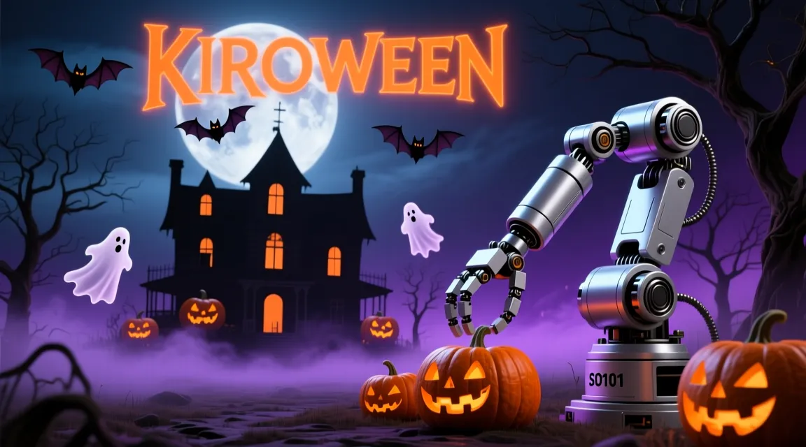

# 👻 Mortis: Haunted Control Room

**Mortis** is an interactive AI experience built with [Gradio](https://www.gradio.app/) for the **Kiroween Hackathon** (https://kiroween.devpost.com/).
At its core, Mortis connects to **Google Gemini API**, giving life to a ghostly digital entity that speaks, feels, and acts through multi-modal voice and text interaction.

As you converse with Mortis, its responses are not limited to text — the spirit manifests itself through a **SeeedStudio SO101 robotic arm**, whose gestures are controlled via the **[LeRobot](https://huggingface.co/lerobot)** framework from Hugging Face.
Each motion of the arm reflects Mortis's emotions and mood, as if the mechanical limb were **possessed** — transforming AI intent into tangible, spectral movement.

**New in v2.0**: Mortis now supports **voice interaction** (speak and listen), **SmolVLA-powered manipulation tasks** (trained on custom demonstrations), and **asynchronous execution** for responsive multi-modal experiences.

This project explores the haunting intersection of **language, embodiment, and robotics**, blending cutting-edge AI with creative storytelling to build a truly haunted control room 👻🤖.


> 📖 For a detailed look into the character and technical architecture, read the **[Project Write-up](WRITEUP.md)**.

## 🎥 Demo




## 🚀 Features

### Core Interaction
- 🎃 **Web UI** with custom Halloween background and dark theme
- 🗣️ **Voice Input** - Speak to Mortis through your microphone (Gemini native audio)
- 🔊 **Voice Output** - Hear Mortis respond with synthesized speech (Google TTS)
- 💬 **Text Chat** - Traditional text-based interaction (backward compatible)
- 🤖 **Multi-Modal AI** - Powered by Google Gemini API with structured responses

### Robotic Control
- 🦾 **Gesture Control** - Predefined expressive movements (wave, point, grab, drop, idle)
- 🎯 **SmolVLA Manipulation** - Vision-language-action model for precise pick-and-place tasks
- ⚡ **Hybrid Async Execution** - Responsive UI during long-running robotic operations
  - Simple threading for quick gestures (1-2s)
  - LeRobot async inference for complex manipulation (30-60s)
- 📹 **Real-time Webcam** - Monitor robot actions through live camera feed

### Training & Data Collection
- 📊 **Dataset Collection** - Record demonstrations using LeRobot's teleoperation
- 🧠 **SmolVLA Training** - Train custom manipulation models on collected data
- 🔄 **Hugging Face Integration** - Push/pull datasets and models from HF Hub
- 📈 **Training Monitoring** - Weights & Biases integration for tracking metrics

### Developer Experience
- 🔐 **Secure Configuration** - Environment variable management with `.env`
- 📦 **Modern Dependency Management** - Fast, reliable builds with [`uv`](https://github.com/astral-sh/uv)
- 🛠️ **Developer-Friendly Makefile** - One-command setup, training, and deployment
- 📝 **Comprehensive Documentation** - Guides for setup, training, voice integration, and troubleshooting


## 🧰 Requirements

- **Python 3.12+**
- **uv** installed
  ```bash
  pip install uv
  ```


## ⚙️ Installation

Clone the repository and sync dependencies with uv:

```bash
git clone https://github.com/jlamperez/mortis.git
cd mortis
uv sync
```

## 🔑 Environment Setup

Create a `.env` file in the project root with your Gemini API credentials:

```bash
# Required: Get your API key from https://aistudio.google.com/app/apikey
GEMINI_API_KEY=your_google_api_key_here

# Optional: Customize model and settings (defaults shown)
GEMINI_MODEL=gemini-2.5-flash
GEMINI_TEMPERATURE=0.2
ROBOT_PORT=/dev/ttyACM1
PORT=7860
```

You can copy the example file and edit it:

```bash
cp .env.example .env
# Then edit .env with your actual API key
```

**Note:** The `.env` file is already in `.gitignore` and will not be committed to version control.

### Getting a Gemini API Key

1. Visit [Google AI Studio](https://aistudio.google.com/app/apikey)
2. Sign in with your Google account
3. Click "Create API Key"
4. Copy the key and paste it into your `.env` file

## 🕹️ Run Mortis

Run via CLI

```bash
make run
```

Or directly as a Python module

```bash
make run-m
# or without make:
uv run python -m mortis.app
```

Mortis will be available at dark mode in http://127.0.0.1:7860/?__theme=dark

### Viewing Logs

By default, you'll see INFO-level logs in your terminal showing what Mortis is doing. To see more detailed logs (including Gemini API calls), set the log level in your `.env` file:

```bash
# In .env file
LOG_LEVEL=DEBUG  # Options: DEBUG, INFO, WARNING, ERROR, CRITICAL
```

For more details, see the [Logging Guide](docs/LOGGING_GUIDE.md).

## 💬 Talking to Mortis

Once Mortis is running, you can interact with it using natural language through **text or voice**.

### Voice Interaction

1. **Click the microphone icon** in the audio input component
2. **Speak your message** (e.g., "Hello Mortis, introduce yourself")
3. **Stop recording** - Mortis will transcribe and respond with voice
4. **Listen to the response** - Audio plays automatically

### Text Interaction

Type your message in the chat box and press Enter. Mortis will respond with text and perform gestures.

### Example Conversations (Gestures)

These prompts trigger expressive gestures:

- "Hi Mortis, introduce yourself with a sinister bow."
- "Mortis, someone is entering the lab from right side… act!"
- "No, they are in the left side."
- "Grab the cursed vial and then release it."
- "Drop the artifact, Mortis. Let the shadows claim it."
- "Mortis, the lights are flickering… check the power core."
- "Raise your claw, Mortis, and point at the source of the whisper."
- "Mortis, something moves behind you — react swiftly."

### Example Manipulation Tasks (SmolVLA)

If you've trained a SmolVLA model and enabled manipulation (`ENABLE_MANIPULATION=true`), try these:

- "Pick up the skull and place it in the green cup"
- "Pick up the skull and place it in the orange cup"
- "Pick up the eyeball and place it in the green cup"
- "Pick up the eyeball and place it in the purple cup"

**Note**: Manipulation tasks require:
1. A trained SmolVLA model checkpoint
2. `ENABLE_MANIPULATION=true` in `.env`
3. `SMOLVLA_CHECKPOINT_PATH` pointing to your model
4. Physical setup matching your training environment (objects, cups, camera positions)


## 🤖 Robot Arm Calibration

Before using the robotic arm for the first time, it needs to be calibrated.
This process sets the initial positions and limits for each motor.

To start the calibration, connect the arm and run:

```bash
make calibrate
```

This command executes the `src/mortis/calibrate.py` script, which will guide you through the calibration process.
Follow the on-screen instructions. The calibration data will be saved in the `.cache/calibration/so101/` directory.

## 🦾 Testing Gestures

To test a specific gesture without running the full application, you can use the `test-gesture` command:

```bash
make test-gesture
```

This command executes the main block of `src/mortis/robot.py`, which connects to the arm, performs a pre-defined gesture, and then disconnects. This is very useful for fine-tuning the movements of each gesture.

By default, it performs the `"drop"` gesture. To test a different one (e.g., `"wave"`), you can edit the `if __name__ == "__main__"` block at the end of `src/mortis/robot.py`:

```python
# In src/mortis/robot.py

if __name__ == "__main__":
    # ... (connection logic is handled here) ...

    # Change "drop" to any other gesture name from the GESTURES dictionary
    mortis_arm.move_arm("wave") # <-- EDIT THIS LINE

    mortis_arm.disconnect()
```

## 🗣️ Voice Interaction Setup

Mortis supports full voice interaction with speech-to-text (STT) and text-to-speech (TTS).

### Quick Setup

Voice features work out-of-the-box with your Gemini API key:

1. **STT**: Uses Gemini native audio processing (no additional setup)
2. **TTS**: Uses Google Cloud TTS (requires Google Cloud credentials) or falls back to gTTS

### Optional: Google Cloud TTS (Better Voice Quality)

For higher quality voice output:

1. **Create a Google Cloud Project**: https://console.cloud.google.com/
2. **Enable Text-to-Speech API**: https://console.cloud.google.com/apis/library/texttospeech.googleapis.com
3. **Create Service Account Key**: https://console.cloud.google.com/apis/credentials
4. **Download JSON key** and add to `.env`:
   ```bash
   GOOGLE_APPLICATION_CREDENTIALS=/path/to/service-account-key.json
   ```

### Voice Configuration

```bash
# In .env file

# STT Provider (default: gemini)
STT_PROVIDER=gemini  # or "google_stt" for Google Cloud STT

# TTS automatically uses Google Cloud TTS if credentials are available
# Otherwise falls back to gTTS (free, no setup required)
```

### Testing Voice Features

```bash
# Test the complete voice pipeline
python -c "from mortis.tools import ask_mortis_with_voice; print(ask_mortis_with_voice('Hello Mortis', generate_audio=True))"
```

For detailed voice integration documentation, see [Voice Integration Guide](docs/VOICE_INTEGRATION_GUIDE.md).

## 🎓 Training SmolVLA Models

Mortis supports training SmolVLA vision-language-action models for advanced manipulation tasks. The training workflow uses LeRobot's native training pipeline.

### Quick Start

1. **Setup dataset infrastructure**:
   ```bash
   make setup-dataset
   # Follow prompts to configure your dataset
   ```

2. **Record demonstrations**:
   ```bash
   cd data/mortis_manipulation/scripts
   ./record_task_0.sh  # Record first task
   # Repeat for all tasks or use ./record_all_tasks.sh
   ```

3. **Generate training scripts**:
   ```bash
   make setup-train ARGS="--dataset-repo-id your-username/mortis_manipulation --model-repo-id your-username/mortis-smolvla --generate-configs"
   ```

4. **Start training**:
   ```bash
   cd train
   ./train_standard.sh  # 20k steps (recommended)
   # or ./train_quick.sh for testing (1k steps)
   # or ./train_full.sh for production (100k steps)
   ```
   
   Training outputs (checkpoints, logs) will be saved to `outputs/train/smolvla_*/`

5. **Monitor training**:
   - Console: Watch terminal output
   - W&B Dashboard: https://wandb.ai (login with `wandb login`)

6. **Enable manipulation in Mortis**:
   ```bash
   # In .env file
   ENABLE_MANIPULATION=true
   SMOLVLA_CHECKPOINT_PATH=outputs/train/smolvla_standard/checkpoints/last
   ```

For detailed training documentation, see:
- [Training Guide](docs/TRAINING_GUIDE.md) - Complete training workflow
- [Data Collection Setup](docs/DATA_COLLECTION_SETUP.md) - Recording demonstrations

## 🧪 Useful Commands

| Command               | What it does                                                                 |
|-----------------------|------------------------------------------------------------------------------|
| `make help`           | Prints all available targets and what they do.                               |
| `make install`        | Installs dependencies with `uv` (creates `.venv/` if missing).               |
| `make sync`           | Alias of `install` (re-sync deps from `pyproject.toml` / `uv.lock`).         |
| `make lock`           | Creates/updates `uv.lock` with resolved versions.                            |
| `make upgrade`        | Upgrades dependencies and regenerates `uv.lock`, then syncs.                 |
| `make run`            | Runs the CLI entrypoint `$(APP)` (requires `[project.scripts]`).             |
| `make run-m`          | Runs the app as a module: `python -m $(MODULE)`.                             |
| `make calibrate`      | Runs the robot arm calibration script.                                       |
| `make demo`           | Runs the example script at `$(DEMO)`.                                        |
| `make test-gesture`   | Executes a test gesture with the robotic arm (`mortis.robot`).               |
| `make setup-dataset`  | Setup dataset infrastructure for data collection.                            |
| `make setup-train`    | Generate training scripts (requires `ARGS='--dataset-repo-id=...'`).         |
| `make check-env`      | Verifies `.env` exists and required env vars (e.g., `GEMINI_API_KEY`).       |
| `make add-<pkg>`      | Adds a dependency via `uv add` (e.g., `make add-python-dotenv`).             |
| `make export`         | Exports pinned deps to `requirements.txt` from `uv.lock`.                    |
| `make clean`          | Removes build/test caches and artifacts.

## 🔧 Troubleshooting

### Common Issues

#### "Gemini API key not found"

**Problem**: Missing or invalid `GEMINI_API_KEY` in `.env` file.

**Solution**:
```bash
# 1. Get API key from https://aistudio.google.com/app/apikey
# 2. Add to .env file
echo "GEMINI_API_KEY=your_actual_key_here" >> .env
# 3. Restart Mortis
make run
```

#### "Robot not connecting"

**Problem**: SO101 arm not detected on USB port.

**Solution**:
```bash
# 1. Check USB connection
ls /dev/ttyACM*
# Should show /dev/ttyACM0 or /dev/ttyACM1

# 2. Update ROBOT_PORT in .env if needed
echo "ROBOT_PORT=/dev/ttyACM0" >> .env

# 3. Check permissions
sudo chmod 666 /dev/ttyACM1

# 4. Recalibrate if needed
make calibrate
```

#### "Voice input not working"

**Problem**: Microphone not accessible or STT service failing.

**Solution**:
```bash
# 1. Check browser permissions (allow microphone access)
# 2. Verify Gemini API key is valid
# 3. Check logs for detailed error:
LOG_LEVEL=DEBUG make run

# 4. Try fallback STT provider
echo "STT_PROVIDER=google_stt" >> .env
```

#### "Audio output not playing"

**Problem**: TTS generation failing or audio file not accessible.

**Solution**:
```bash
# 1. Check outputs/ directory exists and is writable
mkdir -p outputs
chmod 755 outputs

# 2. Verify Google Cloud credentials (optional)
# If using Google TTS, ensure GOOGLE_APPLICATION_CREDENTIALS is set

# 3. System will automatically fall back to gTTS if Google TTS fails
# Check logs for TTS provider being used
```

#### "Manipulation tasks not working"

**Problem**: SmolVLA model not loaded or manipulation disabled.

**Solution**:
```bash
# 1. Ensure manipulation is enabled
echo "ENABLE_MANIPULATION=true" >> .env

# 2. Verify checkpoint path exists
ls outputs/train/smolvla_standard/checkpoints/last/

# 3. Update checkpoint path in .env
echo "SMOLVLA_CHECKPOINT_PATH=outputs/train/smolvla_standard/checkpoints/last" >> .env

# 4. Check GPU availability
python -c "import torch; print(torch.cuda.is_available())"

# 5. Restart Mortis
make run
```

#### "Training fails with CUDA out of memory"

**Problem**: GPU doesn't have enough memory for training batch size.

**Solution**:
```bash
# Edit train/train_standard.sh and reduce batch size
# Change --batch_size=16 to --batch_size=8 or --batch_size=4

# Or use gradient accumulation
# Add --gradient_accumulation_steps=2 to the training command
```

#### "Dataset not found during training"

**Problem**: Dataset not uploaded to Hugging Face or incorrect repo ID.

**Solution**:
```bash
# 1. Verify dataset exists on Hugging Face
# Visit https://huggingface.co/datasets/your-username/dataset-name

# 2. Check HF_USER is set correctly
echo $HF_USER

# 3. Re-record episodes if needed
cd data/mortis_manipulation/scripts
./record_all_tasks.sh

# 4. Verify dataset repo ID in training script matches your HF username
```

#### "UI freezes during manipulation tasks"

**Problem**: Async execution not working properly.

**Solution**:
```bash
# 1. Check logs for async executor errors
LOG_LEVEL=DEBUG make run

# 2. Verify LeRobot async client is initialized
# Look for "LeRobotAsyncClient initialized" in logs

# 3. Restart Mortis to reinitialize async systems
```

### Getting Help

If you encounter issues not covered here:

1. **Check the logs**: Set `LOG_LEVEL=DEBUG` in `.env` for detailed output
2. **Review documentation**:
   - [Troubleshooting Guide](docs/TROUBLESHOOTING.md) - Comprehensive problem-solving guide
   - [Voice Integration Guide](docs/VOICE_INTEGRATION_GUIDE.md)
   - [Training Guide](docs/TRAINING_GUIDE.md)
   - [Data Collection Setup](docs/DATA_COLLECTION_SETUP.md)
   - [Gemini Setup](docs/GEMINI_SETUP.md)
3. **Check LeRobot documentation**: https://github.com/huggingface/lerobot
4. **Verify environment**: Run `make check-env` to validate configuration

### Performance Tips

- **Faster responses**: Use `gemini-2.5-flash` model (default)
- **Better quality**: Use `gemini-1.5-pro` model (slower but more capable)
- **Reduce latency**: Use local TTS (gTTS) instead of Google Cloud TTS
- **GPU optimization**: Ensure CUDA is properly installed for SmolVLA inference

## 📚 Documentation

### Getting Started
- [Quick Reference](docs/QUICK_REFERENCE.md) - Common commands and workflows
- [Troubleshooting Guide](docs/TROUBLESHOOTING.md) - Comprehensive problem-solving guide

### User Guides
- [Voice Interaction User Guide](docs/USER_GUIDE_VOICE.md) - Complete voice interaction walkthrough
- [Voice Integration Guide](docs/VOICE_INTEGRATION_GUIDE.md) - Voice setup and configuration
- [Training Guide](docs/TRAINING_GUIDE.md) - Train SmolVLA models
- [Data Collection Setup](docs/DATA_COLLECTION_SETUP.md) - Record demonstrations

### Technical Documentation
- [Gemini Setup](docs/GEMINI_SETUP.md) - Gemini API integration details
- [STT Service Guide](docs/STT_SERVICE_GUIDE.md) - Speech-to-text implementation
- [TTS Service Guide](docs/TTS_SERVICE_GUIDE.md) - Text-to-speech implementation
- [Async Executor Guide](docs/ASYNC_EXECUTOR_GUIDE.md) - Asynchronous execution system
- [Hybrid Execution System](docs/HYBRID_EXECUTION_SYSTEM.md) - Gesture + manipulation async
- [Logging Guide](docs/LOGGING_GUIDE.md) - Logging configuration and debugging

### Migration Guides
- [Migration to Google GenAI](docs/MIGRATION_TO_GOOGLE_GENAI.md) - API migration details

## 🧛 Credits

Created by Jorge Lamperez
Part of the Kiroween Hackathon 2025 🎃

## 📜 License

MIT License © 2025 Jorge Lamperez
